# Towards Surgical World-Action Modeling

### A Preliminary Joint Visual-Trajectory Forecasting for Surgical Motion Planning

This repository presents qualitative results for a preliminary surgical world-action model that jointly forecasts future visual states and 2D instrument trajectories. Given five observed surgical frames and trajectory points, it predicts the next fifteen steps.

## Visualization Guide

Each animation shows predictions at **t+3, t+6, t+9, t+12, and t+15**, together with the corresponding trajectories:

- **Blue**: historical input
- **Green**: ground truth
- **Red**: prediction

## Direct One-Shot Prediction

All 15 future visual representations and trajectory points are predicted in one forward pass.

<table>
  <tr>
    <td align="center">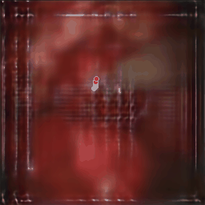 Sample 01</td>
    <td align="center">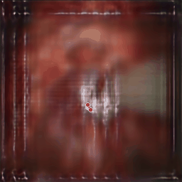 Sample 02</td>
    <td align="center">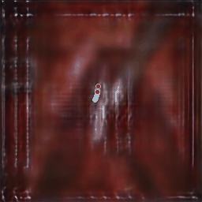 Sample 03</td>
  </tr>
  <tr>
    <td align="center">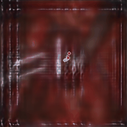 Sample 04</td>
    <td align="center">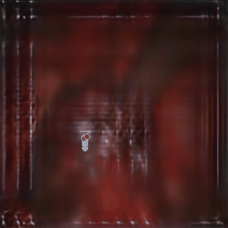 Sample 05</td>
    <td align="center">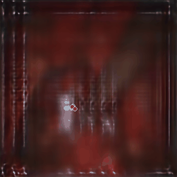 Sample 06</td>
  </tr>
  <tr>
    <td align="center">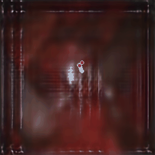 Sample 07</td>
    <td align="center">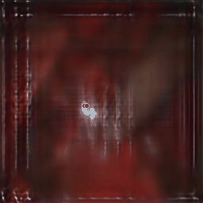 Sample 08</td>
    <td align="center">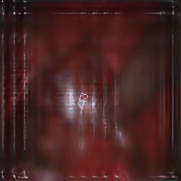 Sample 09</td>
  </tr>
</table>

## Chunked Autoregressive Rollout

Three future steps are predicted at each stage and recursively reused for the full 15-step rollout.

<table>
  <tr>
    <td align="center">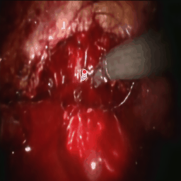 Sample 01</td>
    <td align="center">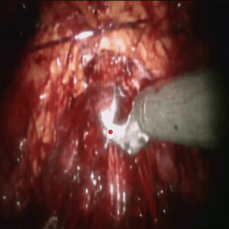 Sample 02</td>
    <td align="center">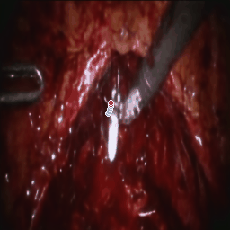 Sample 03</td>
  </tr>
  <tr>
    <td align="center">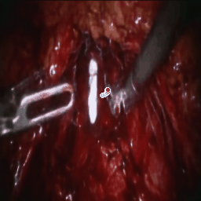 Sample 04</td>
    <td align="center">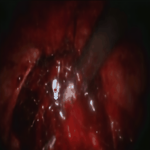 Sample 05</td>
    <td align="center">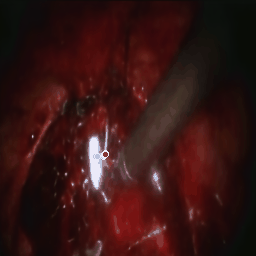 Sample 06</td>
  </tr>
  <tr>
    <td align="center">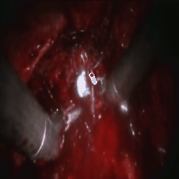 Sample 07</td>
    <td align="center">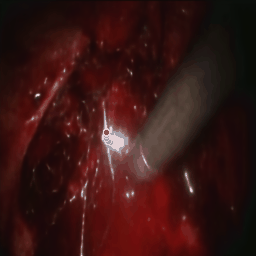 Sample 08</td>
    <td align="center">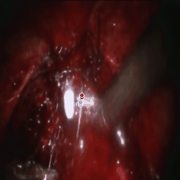 Sample 09</td>
  </tr>
</table>

## Observations

Chunked rollout generally preserves operative-scene structure more effectively and produces trajectories closer to ground truth, especially at early and intermediate horizons; both settings show reduced visual fidelity and accumulated trajectory errors at longer horizons.
